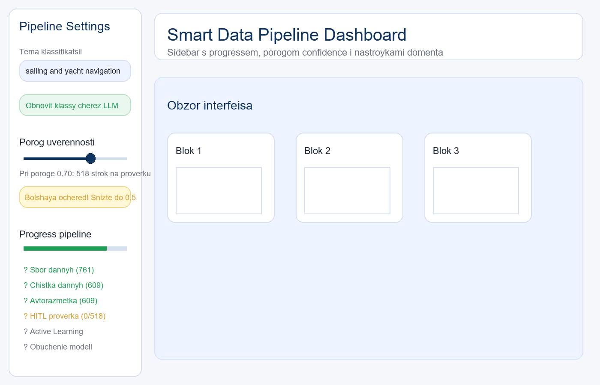
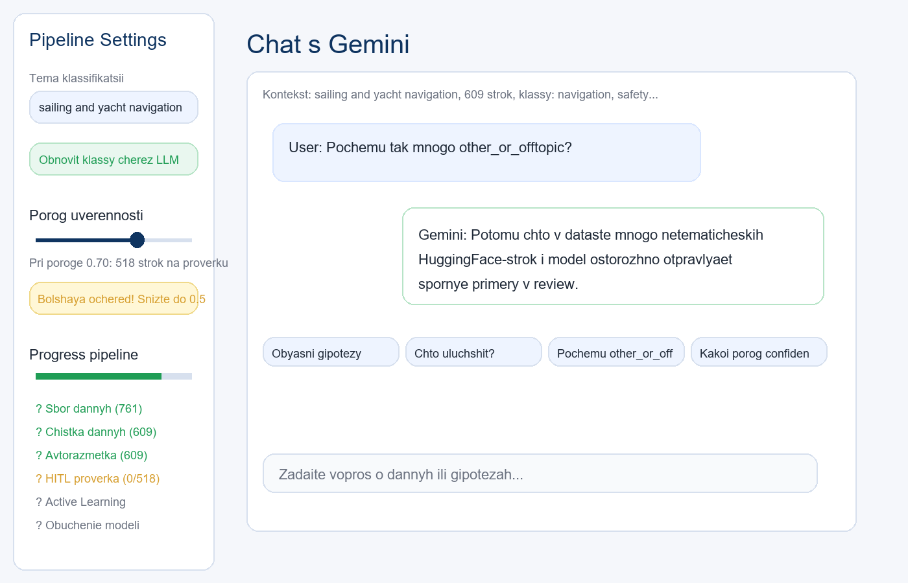

# smart-data-pipeline


An end-to-end educational ML pipeline for domain-driven text classification with data collection, LLM-assisted domain reformulation, and human review.

## Architecture
The project is organized around 4 agents: data collection, data quality, annotation, and active learning.
Prefect is the planned orchestrator for end-to-end pipeline execution and reporting.
Gemini is used as a separate LLM layer for domain reformulation and compact summary-based class design.
Streamlit is the UI layer for review and future human-in-the-loop workflows.

## Data Sources

| Source | Type | License/Status |
| --- | --- | --- |
| HuggingFace (dair-ai/emotion) | dataset | Apache 2.0 |
| HuggingFace (mteb/tweet_sentiment_extraction) | dataset | MIT |
| StackExchange Sailing | API | CC BY-SA 4.0 |
| Yachting World RSS | RSS scraping | educational use |
| Sailing Forums | web scraping | robots.txt checked, educational use |

## Setup

```bash
git clone https://github.com/your-username/smart-data-pipeline.git
cd smart-data-pipeline
python -m venv .venv
.venv\Scripts\activate      # Windows
pip install -r requirements.txt
cp .env.example .env
```

Edit `.env` with your API keys, then edit `config.yaml` to set your classification topic and classes.

## Pipeline Steps (completed)
- [x] Step 0: Project scaffold
- [x] Step 1.1: DataCollectionAgent - 3 sources, 761 rows
- [x] Step 1.2: Scraping improvements - StackExchange API, RSS
- [x] Step 1.3: Gemini LLM - domain reformulation, classes, fallback
- [x] Step 1.4: EDA - 8 charts, WordCloud, LLM hypotheses
- [x] Step 2.1: DataQualityAgent - HTML cleanup, dedup, filtering (761 rows -> 609)
- [x] Step 2.2: DataQualityAgent LLM skill - Gemini explains issues + recommends strategy (+2 bonus)
- [x] Step 3.1: AnnotationAgent - zero-shot, confidence scoring, review_queue.csv (HITL ★)
- [x] Step 3.2: Streamlit HITL dashboard - 4 tabs + report builder + Telegram export

## Reports
| Report | Description |
|--------|-------------|
| reports/eda_report.html | Interactive EDA - charts + hypotheses |
| reports/domain_spec.json | LLM domain specification |
| reports/domain_reformulation.md | Domain reformulation details |
| reports/wordcloud_all.png | WordCloud full corpus |
| reports/wordcloud_domain.png | WordCloud domain sources only |
| reports/quality_report.md | Before/after quality cleanup summary |

## What it looks like

### Streamlit Dashboard

| Sidebar — прогресс пайплайна | HITL — проверка меток |
|---|---|
|  |  |

| Аналитика + конструктор отчёта | Чат с Gemini |
|---|---|
|  |  |

## ✨ Features

### 🤖 Multi-agent pipeline
- **DataCollectionAgent** — сбор из 3+ источников: HuggingFace datasets, StackExchange API, RSS-ленты, форумы
- **DataQualityAgent** — автоматическая чистка: HTML-артефакты, дубликаты, фильтрация коротких текстов
- **AnnotationAgent** — zero-shot авторазметка (facebook/bart-large-mnli) + confidence scoring
- **ActiveLearningAgent** — умный отбор примеров (entropy / margin / random стратегии) *(coming soon)*

### 🧠 LLM-powered (Gemini)
- Переформулировка темы пользователя → классы + ключевые слова
- Объяснение проблем качества данных + рекомендации
- Генерация гипотез после EDA на русском языке
- Чат с данными прямо в дашборде
- Fallback chain: gemini-2.5-flash → gemini-flash-latest → gemma

### 👤 Human-in-the-Loop (HITL)
- Примеры с confidence < порога → очередь на проверку
- Streamlit интерфейс: принять / исправить метку
- Фильтрация по классу и источнику
- Сохранение правок + скачивание CSV

### 📊 Interactive EDA Report
- 8 Plotly-графиков (zoom, hover, pan)
- WordCloud с автоматической фильтрацией HTML-мусора
- LLM-гипотезы на русском языке
- Сворачиваемые секции
- Открывается без сервера (один HTML файл)

### 📋 Report Builder
- Пользователь выбирает секции галочками
- Форматы: HTML / Markdown / Telegram
- Таблица источников с лицензиями и статусом скрапинга

### 🔧 Developer-friendly
- Легко сменить тему: одна строка в config.yaml
- Все шаги покрыты pytest (75+ тестов)
- Prefect оркестрация — запуск одной командой
- Пропуск любого шага с предупреждением о последствиях

## How to change the topic

This pipeline works for **any text classification domain**.
Change one line in `config.yaml`:

```yaml
domain:
  topic: "your topic here"  # e.g. "medical diagnosis", "legal documents"
```

The LLM (Gemini) will automatically:
- reformulate the topic into precise ML task
- generate 5-7 classification classes
- suggest keywords and annotation guidelines

**Example domains tested:**
- Sailing & yacht navigation *(current demo)*
- Any domain with forum/RSS/HuggingFace coverage

## UI — Streamlit Dashboard
```bash
streamlit run ui/app.py
```

Дашборд включает 4 вкладки:
- 🚀 Онбординг: задать тему, LLM предлагает источники, пользователь выбирает
- 🔍 HITL проверка: просмотр и правка меток
- 📊 Аналитика: графики + конструктор отчёта
- 💬 Чат с LLM: вопросы о данных и гипотезах

## Domain
Topic: sailing and yacht navigation
Classes: navigation, safety, equipment, weather, licensing
Review label: other_or_offtopic
