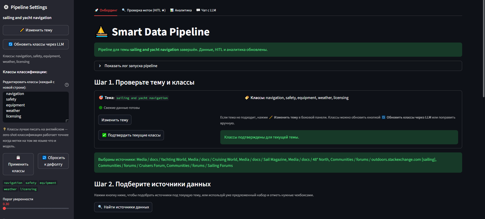
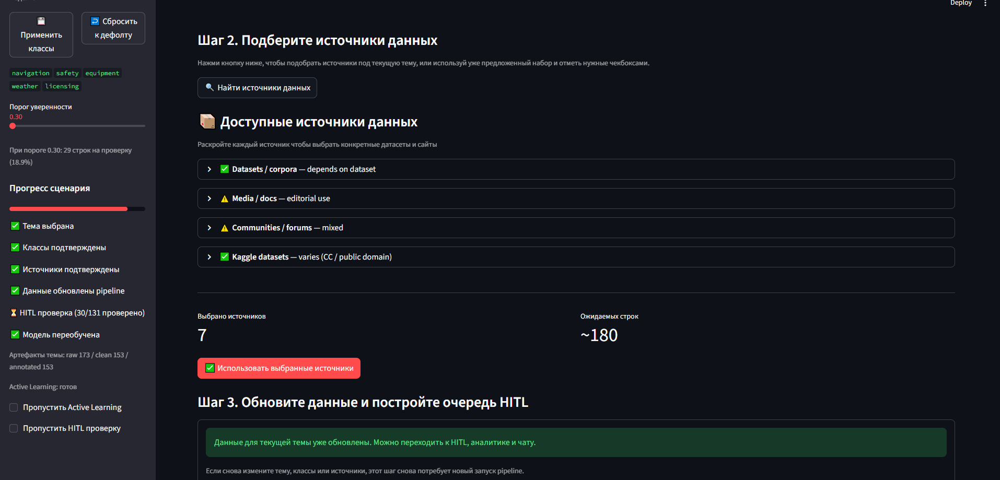
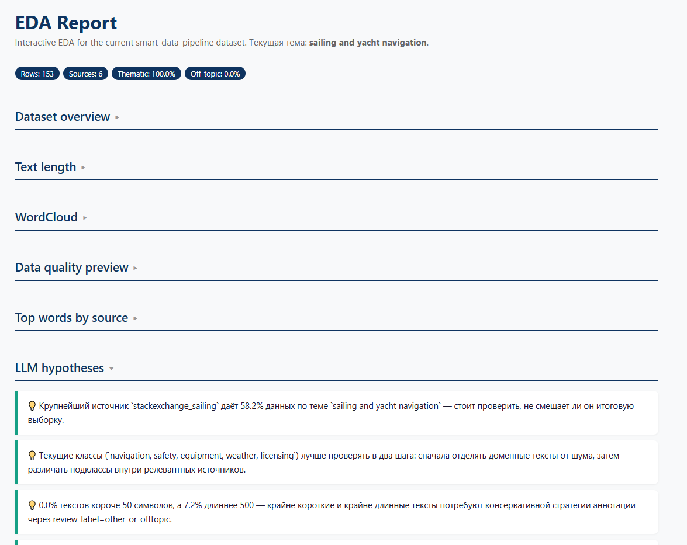
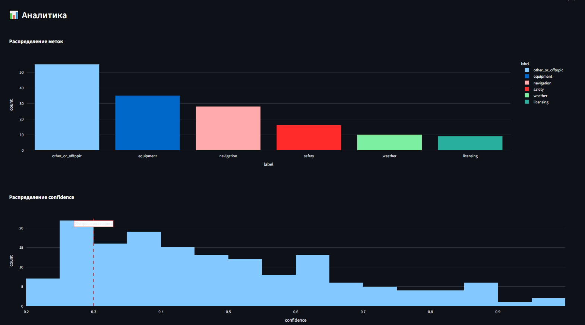
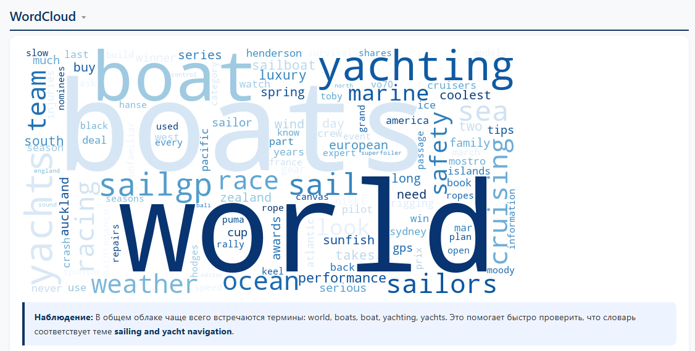
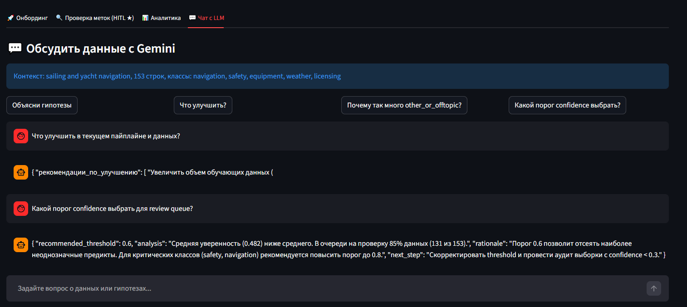

# Smart Data Pipeline


**End-to-end ML пайплайн для тематической классификации текстов.**  
Смените тему в интерфейсе — и система перестроит классы, данные, разметку, HITL-очередь, модель и аналитику под новый домен. Без хардкода тем, без ручной перенастройки.

---

## 📋 Содержание

- [Главная идея](#главная-идея)
- [Решаемая задача](#решаемая-задача)
- [Быстрый старт](#быстрый-старт)
- [Переменные окружения](#переменные-окружения)
- [Пользовательский путь](#пользовательский-путь)
- [Архитектура](#архитектура)
- [Возможности](#возможности)
- [Источники данных](#источники-данных)
- [Data Card](#data-card)
- [Структура проекта](#структура-проекта)
- [Запуск тестов](#запуск-тестов)
- [Отчёты](#отчёты)
- [Известные ограничения](#известные-ограничения)
- [Ретроспектива](#ретроспектива)
- [Roadmap](#roadmap)

---

## Главная идея

> *«Не статичный классификатор под одну тему — перенастраиваемый smart data pipeline.*  
> *Пользователь вводит новую тему, и система перестраивает классы, данные, разметку, HITL-очередь, аналитику и отчёты под новый домен.»*

---

## Решаемая задача

**Демо-тема по умолчанию:** `sailing and yacht navigation`

На вход поступают тексты из разнородных источников: RSS-ленты яхтенных журналов, вопросы с StackExchange, темы с форумов яхтсменов, датасеты HuggingFace. Все тексты — только текстовая модальность (изображения, аудио, видео не поддерживаются; мультимодальность запланирована в roadmap).

**Задача** — автоматически разложить входящий поток по тематическим классам:

| Класс | Что попадает |
|---|---|
| `navigation` | Маршруты, карты, GPS, лоция |
| `safety` | Безопасность, снаряжение, спасение |
| `equipment` | Паруса, такелаж, оборудование лодки |
| `weather` | Погода, ветер, состояние моря |
| `licensing` | Сертификаты, обучение, правила |
| `other_or_offtopic` | Нетематические тексты и шум |

**Кому это нужно:** редактор яхтенного медиа, аналитик яхт-клуба или парусной школы, data analyst, которому нужно триажировать входящий текстовый поток по морским темам.

**Почему не просто классификатор:** тема — лишь пример. Пользователь может сменить домен на `fitness`, `medical diagnosis` или любой другой — и система пересоберёт весь пайплайн под новую предметную область.

> **💡 Совет:** вводите тему и классы на английском.  
> `facebook/bart-large-mnli` обучена на английском — английские метки дают более высокий `confidence score`.  
> Русские метки сработают, но могут снизить точность классификации.

---

## Быстрый старт

```bash
git clone https://github.com/AnastasiaButus/Smart-data-pipeline.git
cd smart-data-pipeline
python -m venv .venv
.venv\Scripts\activate          # Windows PowerShell
pip install -r requirements.txt
cp .env.example .env            # добавить GEMINI_API_KEY в .env

# Запустить весь пайплайн одной командой:
python pipeline/run_pipeline.py

# Или запустить дашборд:
streamlit run ui/app.py         # → http://localhost:8501
```

> **Первый запуск:** `facebook/bart-large-mnli` (~1.6 ГБ) скачивается автоматически. Нужен интернет.

> **Место на диске:** полная установка занимает ~3.5 ГБ (`.venv` ~2 ГБ + кэш модели ~1.6 ГБ).

---

## Переменные окружения

Создайте `.env` на основе `.env.example`:

| Переменная | Обязательность | Назначение |
|---|---|---|
| `GEMINI_API_KEY` | ✅ Рекомендуется | LLM-функции: подбор классов, EDA-гипотезы, объяснения качества данных, чат. Без ключа core pipeline работает через fallback. |
| `KAGGLE_API_TOKEN` | ⚙️ Опционально | Kaggle-датасеты. Включить в `config.yaml`: `sources.kaggle.enabled: true` |
| `TELEGRAM_BOT_TOKEN` | ⚙️ Опционально | Отправка отчётов через Telegram из UI |

> Переменные `REDDIT_*` есть в `.env.example` как плейсхолдеры, но **runtime-кодом не читаются**.  
> `TELEGRAM_CHAT_ID` вводится через UI, не через `.env`.

---

## Пользовательский путь

Полный маршрут от настройки темы до обученной модели — всё внутри Streamlit-дашборда.

---

### Шаг 1 — Настройка темы и классов

Открыть дашборд → проверить или сменить тему в сайдбаре → подтвердить классы (или обновить через LLM).



*Сайдбар: текущая тема, редактируемый список классов, порог уверенности, прогресс пайплайна. Главная панель ведёт по 3 шагам онбординга.*

---

### Шаг 2 — Выбор источников данных

Нажать **🔍 Найти источники данных** → раскрыть группы источников → отметить нужные → подтвердить выбор.



*Источники сгруппированы по типу и лицензии. Счётчик показывает число выбранных источников и ожидаемый объём строк. Прогресс-трекер слева отражает подтверждённые шаги.*

---

### Шаг 3 — Запуск пайплайна

Нажать **▶ Обновить данные для этой темы** — Prefect последовательно запускает 4 агента:  
`DataCollection → DataQuality → Annotation → ActiveLearning → ModelTraining`

Артефакты сохраняются в `data/` и `reports/` после каждого прогона.

---

### Шаг 4 — HITL-проверка и переобучение

Перейти на вкладку **🔍 Проверка меток (HITL ★)** → просмотреть примеры с низкой уверенностью → принять или исправить метку → нажать **🔄 Запустить переобучение**.

После переобучения выводятся метрики и F1 по каждому классу.

| Метрика | Baseline | После HITL |
|---|---|---|
| Accuracy | 0.50 | 0.64 |
| F1 macro | 0.43 | 0.55 |
| Cohen's κ | — | 1.0 |
| N train | 166 | 196 |

---

### Шаг 5 — Аналитика

Перейти на вкладку **📊 Аналитика** → смотреть распределение меток, гистограмму уверенности, WordCloud, LLM-гипотезы.



*Распределение меток + гистограмма confidence с маркером порога. Визуальный срез того, в чём модель неуверена.*

---

### Шаг 6 — EDA-отчёт (HTML)

EDA-отчёт генерируется как автономный интерактивный HTML с 8 Plotly-графиками, сворачиваемыми секциями и LLM-гипотезами.



*Разделы: Dataset overview · Text length · WordCloud · Data quality preview · Top words by source · LLM hypotheses*

---

### Шаг 7 — WordCloud



*Тематическое облако слов с фильтрацией HTML-артефактов. Позволяет быстро проверить, что словарь соответствует целевой теме.*

---

### Шаг 8 — Чат с LLM

Перейти на вкладку **💬 Чат с LLM** → задать вопросы о текущих данных, гипотезах или рекомендациях по пайплайну.



*Gemini знает контекст: текущую тему, количество строк, список классов и артефакты пайплайна. Кнопки быстрых вопросов для частых сценариев.*

---

## Архитектура

Проект построен на **4 агентах**, оркестрируемых Prefect:

```
Пользователь (Streamlit UI)
        │
        ▼
┌─────────────────────────────────────────────┐
│              Prefect Pipeline               │
│                                             │
│  DataCollectionAgent                        │
│    → HuggingFace, StackExchange, RSS,       │
│      форумы, Kaggle (опционально)           │
│    → проверка robots.txt, fuzzy dedup       │
│                  ↓                          │
│  DataQualityAgent                           │
│    → очистка HTML, дедупликация,            │
│      fuzzy matching, LLM-советы             │
│                  ↓                          │
│  AnnotationAgent                            │
│    → zero-shot (bart-large-mnli)            │
│    → confidence scoring → review_queue.csv  │
│                  ↓                          │
│  ActiveLearningAgent                        │
│    → стратегии entropy / margin / random    │
│    → learning curve, сравнение стратегий    │
│                  ↓                          │
│  ModelWrapper (TF-IDF + LogReg)             │
│    → fit / predict / evaluate / save        │
└─────────────────────────────────────────────┘
        │
        ▼
  ContextMemory (reports/context_memory.json)
  — сохраняется между запусками, общий для всех агентов
```

**LLM-слой (Gemini)** отделён от core pipeline:
- Domain reformulation → ML-постановка с классами и ключевыми словами
- Объяснения проблем качества и рекомендации по чистке
- Генерация EDA-гипотез
- Чат с контекстом пайплайна
- Fallback chain: `gemini-2.5-flash → gemini-flash-latest → gemma`

---

## Возможности

### 🤖 Мультиагентный пайплайн
- **DataCollectionAgent** — HuggingFace datasets, Kaggle API, StackExchange API, RSS-ленты, форумы яхтсменов
- **DataQualityAgent** — удаление HTML-артефактов, точная и нечёткая дедупликация, фильтрация коротких текстов, LLM-советы по качеству
- **AnnotationAgent** — zero-shot классификация (bart-large-mnli), confidence scoring, формирование review queue, экспорт в LabelStudio
- **ActiveLearningAgent** — стратегии entropy / margin / random, learning curve, сравнение стратегий

**Сравнение AL-стратегий:** `margin (0.62) > entropy (0.41) > random (0.13)` при N=110

### 🔍 Умная дедупликация
- Точная дедупликация по нормализованному тексту
- Нечёткое совпадение через `rapidfuzz` — находит почти-дубликаты с >90% сходством
- Ловит варианты вроде `Sailing in bad weather` vs `Sailing in bad weather!`, которые точное совпадение пропускает

### 🧪 Классификационная модель (TF-IDF + LogReg)

Реализована в `core/model_wrapper.py` как sklearn pipeline:

```python
Pipeline([
    ("tfidf", TfidfVectorizer(max_features=10000, ngram_range=(1, 2), sublinear_tf=True)),
    ("clf",   LogisticRegression(max_iter=1000, class_weight="balanced", C=1.0))
])
```

- `class_weight="balanced"` — компенсирует дисбаланс классов (много `other_or_offtopic`)
- `ngram_range=(1, 2)` — учитывает биграммы, важные для доменной лексики (`yacht club`, `safety gear`)
- `sublinear_tf=True` — логарифмическое масштабирование TF, снижает вес частых слов
- Стратифицированный split 80/20 (с fallback на обычный, если класс слишком мал)
- Перед обучением: удаляются `unlabeled`, пустые тексты, классы с < 2 примерами
- Сохранение: `models/classifier.pkl` + `models/label_encoder.pkl` через `joblib`
- Дополнительно: `explain(texts)` возвращает топ-10 TF-IDF признаков по коэффициентам LogReg
- DistilBERT: stub готов в `model_wrapper.py`, бросает `NotImplementedError` (в roadmap)

### 💰 Экономия токенов Gemini

Проект не отправляет сырые данные в LLM — только компактные сводки:

| Место в коде | Лимит промпта |
|---|---|
| `generate()` — основной вызов | 800 символов |
| `_build_prompt()` — domain spec | 800 символов |
| `_build_eda_hypotheses_prompt()` | 600 символов |
| `generate_stopwords()` | 600 символов |
| `_compact_summary_json()` — сводка данных | 350 символов, только топ-источники и ключевые слова |
| `get_summary_for_llm()` в ContextMemory | 500 символов, последние 3 шага пайплайна |
| `answer_with_llm()` в UI (чат) | 800 символов |
| `generate_spec()` в AnnotationAgent | 600 символов |
| `explain_issues()` в DataQualityAgent | 800 символов |

Отдельного persistent cache ответов Gemini нет — экономия достигается жёсткой обрезкой промптов на уровне клиента.

### 🧠 LLM-функции (Gemini)
- Domain reformulation: тема → ML-постановка с классами и ключевыми словами
- Объяснение проблем качества данных и рекомендации по стратегии чистки
- Генерация EDA-гипотез
- Чат с контекстом пайплайна прямо в дашборде
- Fallback chain — core pipeline не блокируется при недоступности LLM

### 👤 Human-in-the-Loop (HITL)
- Примеры с `confidence < threshold` попадают в `review_queue.csv`
- Streamlit-карточки: принять или исправить метку, фильтрация по классу и источнику
- Сохранение правок и скачивание CSV
- Переобучение на исправленных данных с live-метриками и F1 по классам
- Cohen's κ = 1.0 на 30 проверенных примерах

### 📊 Интерактивный EDA-отчёт
- 8 интерактивных Plotly-графиков
- WordCloud с фильтрацией HTML-артефактов
- LLM-гипотезы
- Сворачиваемые секции, экспорт в автономный HTML

### ⚙️ Оркестрация
- Prefect `@flow/@task` — весь пайплайн одной командой
- Флаги `skip_hitl` и `skip_al` для пропуска тяжёлых шагов
- `ContextMemory` — сохраняет результаты каждого агента на диск (`reports/context_memory.json`)
- Graceful degradation — пайплайн не падает из-за недоступности внешних API

### 📋 Конструктор отчётов
- Пользователь выбирает секции галочками
- Форматы: HTML / Markdown / Telegram
- Таблица источников с лицензиями и статусом скрапинга
- Data Card с полными метриками проекта

---

## Источники данных

| Источник | Тип | Лицензия | Статус |
|---|---|---|---|
| HuggingFace (dair-ai/emotion) | датасет | Apache 2.0 | ✅ |
| HuggingFace (mteb/tweet_sentiment_extraction) | датасет | MIT | ✅ |
| Kaggle datasets | API | varies | ✅ |
| StackExchange Sailing | API | CC BY-SA 4.0 | ✅ |
| RSS-ленты (Yachting World, Cruising World, Sail Magazine, 48 North) | RSS | editorial | ⚠️ |
| Форумы яхтсменов | веб-скрапинг | robots.txt проверен | ⚠️ |

**Этичный скрапинг:** проверка `robots.txt` перед каждым запросом · задержка `time.sleep(1)` · честный User-Agent · только образовательное/некоммерческое использование.

---

## Data Card

| Параметр | Значение |
|---|---|
| Домен | Sailing & yacht navigation |
| Язык | English |
| Модальность | Только текст (мультимодальность в roadmap) |
| Источников | 8 |
| Строк собрано | 761 |
| Строк после чистки | 609 |
| Тематических строк | 220 (23.4%) |
| Классов | 5 + other_or_offtopic |
| Модель | sklearn TF-IDF + LogReg |
| Accuracy | 0.50 → 0.64 (после HITL) |
| F1 macro | 0.43 → 0.55 (после HITL) |
| HITL проверено | 30 / 518 |
| Тестов | 113 passed |

### Классы

| Класс | Описание | Строк |
|---|---|---|
| `navigation` | Маршруты, карты, GPS, лоция | 51 |
| `safety` | Снаряжение, безопасность, спасение | 77 |
| `equipment` | Паруса, такелаж, оборудование лодки | 59 |
| `weather` | Погода, ветер, состояние моря | 24 |
| `licensing` | Сертификаты, обучение, правила | 9 |
| `other_or_offtopic` | Нетематические тексты | 389 |

---

## Структура проекта

```
smart-data-pipeline/
├── agents/
│   ├── data_collection_agent.py
│   ├── data_quality_agent.py
│   ├── annotation_agent.py
│   └── al_agent.py
├── core/
│   ├── context_memory.py        # сохраняется в reports/context_memory.json
│   ├── llm_client.py            # Gemini fallback chain + обрезка промптов
│   └── model_wrapper.py         # TF-IDF + LogReg (stub DistilBERT готов)
├── data/
│   ├── raw/dataset.parquet
│   ├── raw/dataset_clean.parquet
│   ├── labeled/annotated.parquet
│   └── review_queue.csv
├── docs/screenshots/            # скриншоты UI для README
├── models/
│   ├── classifier.pkl
│   └── label_encoder.pkl
├── notebooks/
│   ├── eda.ipynb
│   ├── al_experiment.ipynb
│   └── export_eda.py
├── pipeline/
│   └── run_pipeline.py          # Prefect flow — один запуск делает всё
├── reports/                     # автогенерируемые артефакты
├── tests/                       # 113 тестов
├── ui/
│   └── app.py                   # Streamlit-дашборд
├── config.yaml                  # тема, классы, настройки источников
├── .env.example
└── requirements.txt
```

---

## Запуск тестов

```bash
# Все тесты
.venv\Scripts\python.exe -m pytest tests -v --tb=short

# По модулям
pytest tests\test_ui.py -v                  # UI и конструктор отчётов
pytest tests\test_pipeline.py -v            # оркестрация Prefect
pytest tests\test_data_collection.py -v     # агент сбора данных
pytest tests\test_llm_client.py -v          # LLM-клиент (в основном моки)
pytest tests\test_eda_export.py -v          # экспорт EDA
```

> Два теста в `test_data_collection.py` делают реальные сетевые вызовы к HuggingFace (`test_huggingface_fetch`, `test_huggingface_validates_text_column`). Все Gemini-тесты замоканы.

---

## Отчёты

| Отчёт | Описание |
|---|---|
| `reports/domain_reformulation.md` | Детали domain reformulation |
| `reports/quality_report.md` | Сводка данных до/после чистки |
| `reports/annotation_spec.md` | Спецификация разметки |
| `reports/eda_report.html` | Интерактивный EDA-отчёт (Plotly) |
| `reports/model_metrics.json` | Финальные метрики модели |
| `reports/learning_curve.html` | Кривая активного обучения |
| `reports/strategy_comparison.html` | Сравнение AL-стратегий |
| `reports/context_memory.json` | Состояние пайплайна между запусками |
| `models/classifier.pkl` | Обученная sklearn-модель |

---

## Известные ограничения

- **Gemini free tier** может возвращать `429 RESOURCE_EXHAUSTED` или `503 UNAVAILABLE` — пайплайн деградирует корректно, но LLM-функции будут недоступны
- **Первый запуск** скачивает `facebook/bart-large-mnli` (~1.6 ГБ) — медленно на CPU, нужен интернет
- **Вывод пайплайна в UI** буферизуется до конца процесса (`subprocess.run(..., capture_output=True)` в `ui/app.py`)
- **Гранулярность источников в онбординге** жёстко привязана к sailing-коллектору; для других тем основной путь — `topic_bootstrap` / тематические датасеты HuggingFace
- **Kaggle-коллектор** выключен по умолчанию (`sources.kaggle.enabled: false` в `config.yaml`)
- **DistilBERT** не реализован — в `core/model_wrapper.py` только stub с `NotImplementedError`; рабочий классификатор — TF-IDF + LogReg
- **После смены темы в Jupyter** — нужен Restart Kernel + Run All
- **Streamlit** выводит в логи deprecation warning по `use_container_width` (косметически, не влияет на работу)
- **Скрапинг** зависит от доступности сайтов и правил `robots.txt`

---

## Ретроспектива

**Что сработало хорошо**
- Fallback chain для Gemini — пайплайн не падает полностью при недоступности LLM
- `ContextMemory` — каждый агент знает, что сделал предыдущий
- Graceful degradation везде — тесты проходят без реальных API-вызовов
- Streamlit UI — ключевые действия доступны без CLI

**Что можно улучшить**
- Только 23.4% тематических данных — нужно больше sailing-специфичных источников
- Классы `navigation` и `weather` слабые (F1 < 0.35) из-за малого числа примеров
- Gemini на free tier нестабилен — стоит рассмотреть более стабильный тариф или провайдера
- `sailingforums` сильно проседает после чистки (20 → 5 строк)

**Что сделала бы иначе**
- Добавила бы аугментацию для малых классов
- Реализовала бы fine-tune DistilBERT как следующий baseline upgrade

---

## Roadmap

- [ ] Мультимодальность — изображения + текст
- [ ] Аудио-модальность — речь через Whisper
- [ ] Табличные данные + текст — Kaggle structured datasets совместно с текстовыми источниками
- [ ] DistilBERT — transformer-классификатор (stub готов в `model_wrapper.py`)
- [ ] Экспорт в PDF / Notion
- [ ] Hidden API scraping — паттерн через Network tab браузера (stub в методе `scrape()`)
