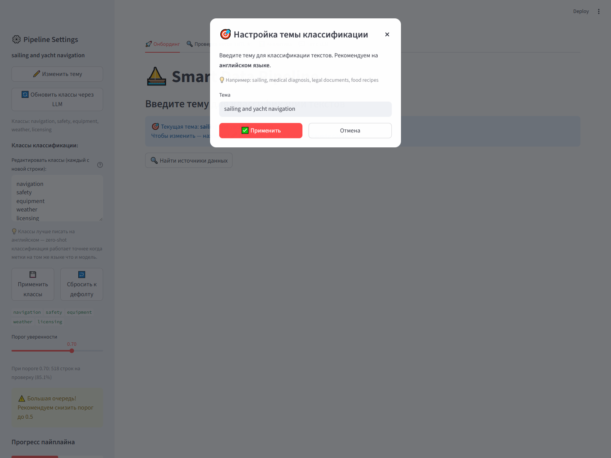
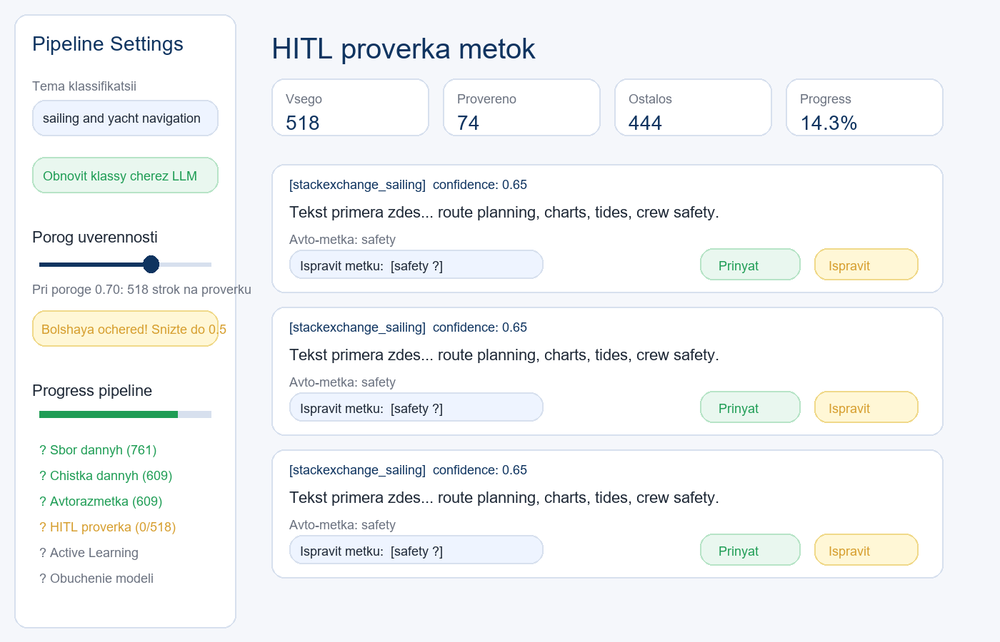
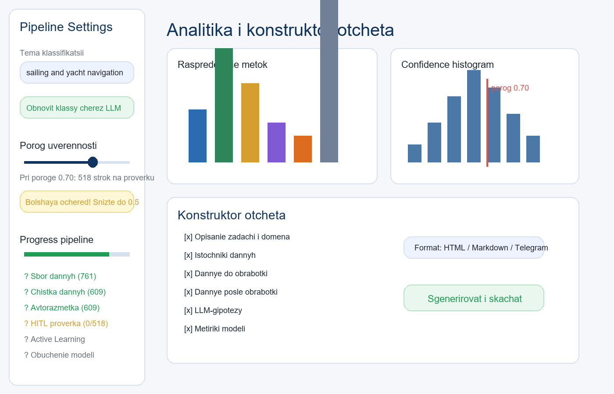
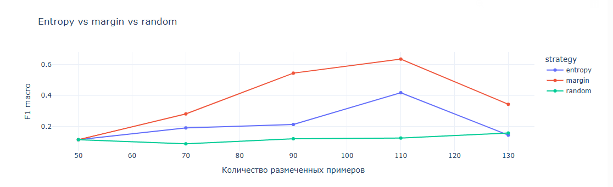
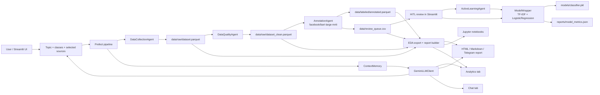
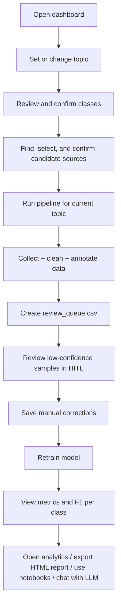

# Smart Data Pipeline


> End-to-end pipeline for topic-driven text classification: from topic selection and data collection to zero-shot labeling, HITL review, retraining, analytics, HTML reports, and research notebooks.

## What This Project Does

`Smart Data Pipeline` is a flexible text-classification system with a friendly Streamlit dashboard and a full backend pipeline.

The key idea is simple:

1. The user sets a topic.
2. The pipeline rebuilds data and labels for that topic.
3. Low-confidence examples go to a Human-in-the-Loop queue.
4. After manual fixes, the model is retrained.
5. The user gets metrics, analytics, HTML reports, and optional Jupyter notebooks.

This is not just a notebook or a single classifier. It is a coordinated system with:

- a topic-aware onboarding flow
- multi-source text collection
- automatic data cleaning
- fuzzy duplicate detection
- zero-shot annotation
- HITL review queue
- active learning experiments
- retraining and final metrics
- interactive analytics and exportable reports

## Interface Preview

### Topic-aware onboarding


### HITL review


### Analytics dashboard


### Active Learning comparison


## Why It Is Strong

- **Topic-first workflow**: the project is not hardcoded to a single domain.
- **Flexible user path**: topic, classes, confidence threshold, sources, report sections, and export format are configurable.
- **HITL is real, not decorative**: manual corrections are saved and fed back into retraining.
- **Graceful degradation**: if Gemini quota is exhausted, the core pipeline still works with fallbacks.
- **Notebook layer included**: Jupyter notebooks are available as a research companion, but the main workflow already works in the dashboard.
- **Artifacts are materialized on disk**: raw, clean, annotated, queue, model, metrics, and reports are all persisted.

## Architecture



## User Journey



## Technology Stack

| Layer | Technologies | What it does |
|---|---|---|
| UI | `Streamlit`, `Plotly` | onboarding, HITL, analytics, report builder, chat |
| Orchestration | `Prefect` | one-command end-to-end pipeline |
| Data collection | `datasets`, `requests`, `BeautifulSoup4`, `feedparser`, `kaggle` | HuggingFace, RSS, forums, StackExchange, optional Kaggle |
| Data cleaning | `pandas`, `rapidfuzz` | HTML cleanup, exact dedup, fuzzy dedup, length filtering |
| Annotation | `transformers`, `torch` | zero-shot labeling with `facebook/bart-large-mnli` |
| Active Learning | `scikit-learn`, `Plotly` | `entropy`, `margin`, `random` strategies and comparison |
| Model | `scikit-learn`, `joblib` | TF-IDF + LogisticRegression baseline |
| LLM layer | `google-genai` | topic reformulation, class refresh, source suggestions, EDA hypotheses, chat |
| Reports | HTML / Markdown / Telegram | downloadable report generation |
| Research layer | `Jupyter`, `wordcloud`, `Plotly` | EDA notebook and AL experiment notebook |

## Project Structure

```text
smart-data-pipeline/
+-- agents/
|   +-- data_collection_agent.py   # multi-source collection + topic bootstrap
|   +-- data_quality_agent.py      # cleanup, quality report, fuzzy dedup
|   +-- annotation_agent.py        # zero-shot labeling + review queue + kappa
|   `-- al_agent.py                # active learning cycles and strategy comparison
+-- core/
|   +-- llm_client.py              # Gemini wrapper with fallbacks
|   +-- model_wrapper.py           # TF-IDF + LogisticRegression model harness
|   `-- context_memory.py          # persistent step-by-step context memory
+-- pipeline/
|   `-- run_pipeline.py            # Prefect flow orchestration
+-- ui/
|   +-- app.py                     # main Streamlit dashboard
|   `-- report_generator.py        # HTML / Markdown / Telegram export helpers
+-- notebooks/
|   +-- eda.ipynb                  # research EDA notebook
|   +-- al_experiment.ipynb        # active learning comparison notebook
|   `-- export_eda.py              # standalone HTML EDA export
+-- data/
|   +-- raw/
|   |   +-- dataset.parquet
|   |   `-- dataset_clean.parquet
|   +-- labeled/
|   |   `-- annotated.parquet
|   `-- review_queue.csv
+-- models/
|   +-- classifier.pkl
|   `-- label_encoder.pkl
+-- reports/
|   +-- eda_report.html
|   +-- model_metrics.json
|   +-- quality_report.md
|   +-- annotation_spec.md
|   +-- context_memory.json
|   `-- ...
+-- docs/
|   `-- screenshots/
+-- tests/
`-- config.yaml
```

## Installation

### 1. Clone the repository

```powershell
git clone https://github.com/AnastasiaButus/Smart-data-pipeline.git
cd smart-data-pipeline
```

### 2. Create and activate a virtual environment

```powershell
python -m venv .venv
.\.venv\Scripts\Activate.ps1
```

### 3. Install dependencies

```powershell
pip install -r requirements.txt
```

### 4. Create `.env`

```powershell
Copy-Item .env.example .env
```

Then open `.env` and fill the values you need.

## API Keys and Where to Put Them

All environment variables go into:

- `.env`

### Minimum setup

```env
GEMINI_API_KEY=your_real_key_here
```

### Full `.env` example

```env
GEMINI_API_KEY=your_real_key_here
KAGGLE_API_TOKEN=your_kaggle_api_token
REDDIT_CLIENT_ID=your_reddit_client_id
REDDIT_CLIENT_SECRET=your_reddit_client_secret
REDDIT_USER_AGENT=smart-data-pipeline/0.1
TELEGRAM_BOT_TOKEN=optional_for_report_export
```

### What each key is used for

| Variable | Required | Used for | Where to get it |
|---|---|---|---|
| `GEMINI_API_KEY` | recommended | LLM class refresh, source suggestions, EDA hypotheses, chat | Google AI Studio |
| `KAGGLE_API_TOKEN` | optional | Kaggle collector, only if Kaggle is enabled in config | Kaggle account |
| `TELEGRAM_BOT_TOKEN` | optional | sending report to Telegram from the dashboard | BotFather |
| `REDDIT_*` | reserved | placeholders for future extensions, not required for current run | optional |

### Important tip

If you replace the Gemini key while Streamlit is already running, **restart Streamlit** so the cached LLM client picks up the new key.

## Quick Start

### Run the full pipeline

```powershell
python pipeline/run_pipeline.py
```

### Run the dashboard

```powershell
streamlit run ui/app.py
```

### Run tests

```powershell
pytest tests -v --tb=short
```

## How the Topic Logic Works

The system is built around a **topic-first** workflow.

When the user changes the topic in the UI:

1. the selected topic is stored in `session_state` and `config.yaml`
2. topic-aware fallback classes are generated immediately
3. the user reviews and explicitly confirms the current classes
4. the user finds, selects, and explicitly confirms the data sources
5. stale artifacts are detected and clearly marked
6. only then is the pipeline unlocked for the new topic
7. analytics, HITL, report builder, and chat switch to the new topic only after fresh artifacts are ready

This order is intentional. The dashboard does **not** auto-run the pipeline immediately after a topic change anymore. The run button is enabled only after:

- class confirmation
- source confirmation

This prevents an inconsistent UX where a new topic could start processing before the user had approved the domain setup.

For best results:

- enter the topic in **English**
- keep class labels in **English**

This matters because the zero-shot model is:

- `facebook/bart-large-mnli`

and it works best with English labels.

## Data Collection Logic

### Implemented collectors

The project already implements these collectors:

- HuggingFace datasets
- RSS feeds
- forum scraping
- StackExchange public API
- optional Kaggle import

### Domain behavior

The collection behavior depends on the topic:

- **Sailing / yachting topics**
  - HuggingFace
  - RSS
  - forums
  - StackExchange
- **Non-sailing topics**
  - topic-aware bootstrap corpus
  - optional topic-specific HuggingFace datasets if configured
  - sailing-specific RSS/forum/StackExchange sources are skipped

This is why the project can still demonstrate a full end-to-end flow for a brand-new topic even when real external sources are not yet configured for that domain.

### Ethical scraping

The scraping layer follows several safety rules:

- `robots.txt` checks before scraping
- rate limiting with delays between requests
- honest user-agent string
- graceful failure on blocked or unavailable sources

### Kaggle note

Kaggle is currently present in the UI and backend, but the default configured Kaggle datasets are **not text datasets**.  
Because of that, Kaggle is intentionally shown as disabled until suitable text datasets are configured.

## Data Cleaning Logic

The cleaning layer is implemented in `DataQualityAgent`.

It can:

- decode HTML entities
- remove HTML / WordPress-style artifacts
- drop missing values
- remove exact duplicates by normalized text
- remove **fuzzy duplicates** with `rapidfuzz`
- filter short texts
- truncate overlong texts
- compare before/after quality metrics
- generate quality advice and a Markdown quality report

### Fuzzy duplicate logic

This is one of the useful practical features of the project.

Exact deduplication catches only identical strings.  
Fuzzy duplicate detection additionally catches near-duplicates, for example:

- same sentence with slightly different punctuation
- title variants with extra boilerplate
- templated copies with small wording changes

The default threshold is configured in `config.yaml`:

- `quality.fuzzy_threshold: 90.0`

## Annotation and HITL

`AnnotationAgent` performs:

- zero-shot labeling with `facebook/bart-large-mnli`
- confidence scoring
- automatic split into:
  - confident labeled data
  - low-confidence review queue

Low-confidence examples are written to:

- `data/review_queue.csv`

The dashboard allows the user to:

- inspect low-confidence texts
- accept the suggested label
- correct the label manually
- save manual corrections
- retrain the model from corrected data

### Agreement metric

The project also computes **Cohen's kappa** between:

- auto-labels
- HITL corrections

This is a strong quality signal because it shows not only model output, but also how well automatic annotation agrees with human review.

## Active Learning and Model Training

### Active Learning

`ActiveLearningAgent` supports:

- `entropy`
- `margin`
- `random`

It can:

- run iterative AL cycles
- compare strategies
- build learning curves
- save strategy comparison reports

### Final model

The production baseline model is:

- `TF-IDF + LogisticRegression`

implemented in:

- `core/model_wrapper.py`

It supports:

- `fit`
- `predict`
- `predict_proba`
- `evaluate`
- `explain`
- `save`
- `load`

### Final metrics

The final model metrics are saved to:

- `reports/model_metrics.json`

and are also shown directly in the dashboard after retraining:

- Accuracy
- F1 macro
- N train
- F1 per class

### DistilBERT

The project already includes a **DistilBERT upgrade stub** in `ModelWrapper`, but the current stable baseline is still the sklearn model.

## Dashboard Features

The Streamlit UI is intentionally not just a demo shell. It is the main user interface of the project.

### Sidebar

The sidebar contains:

- current topic
- editable class list
- confidence threshold
- pipeline progress
- skip toggles for HITL and Active Learning

### Onboarding tab

The onboarding tab provides:

- topic selection flow
- topic-aware emoji in the main title
- explicit class confirmation
- source suggestions
- checkbox-based source selection
- explicit source confirmation
- pipeline refresh for the new topic only after onboarding is confirmed

### HITL tab

The HITL tab provides:

- review queue filtering
- approve / correct actions
- queue export
- retraining from corrected labels

### Analytics tab

The analytics tab provides:

- label distribution
- confidence distribution
- source table
- EDA report download
- notebook launch commands
- report builder

### Chat tab

The chat tab provides:

- context-aware chat with Gemini
- quick prompts
- fallback answers if LLM is unavailable

## Reports and Artifacts

| Artifact | Purpose |
|---|---|
| `data/raw/dataset.parquet` | merged raw dataset |
| `data/raw/dataset_clean.parquet` | cleaned dataset |
| `data/labeled/annotated.parquet` | annotated dataset |
| `data/review_queue.csv` | low-confidence examples for HITL |
| `models/classifier.pkl` | trained classifier |
| `models/label_encoder.pkl` | label encoder |
| `reports/model_metrics.json` | final model metrics |
| `reports/quality_report.md` | quality before/after summary |
| `reports/annotation_spec.md` | annotation instructions |
| `reports/eda_report.html` | interactive standalone EDA report |
| `reports/eda_hypotheses.json` | LLM hypotheses for the dataset |
| `reports/context_memory.json` | step-by-step pipeline memory |

## Report Builder

The dashboard includes a report builder with checkbox-based section selection.

Supported export formats:

- HTML
- Markdown
- Telegram

The user can choose which sections to include, for example:

- domain description
- data sources
- before/after cleaning
- LLM hypotheses
- HITL stats
- model metrics
- retrospective

## Jupyter Notebooks

The project also includes two notebooks:

- `notebooks/eda.ipynb`
- `notebooks/al_experiment.ipynb`

They are an **additional research layer**, not the main product interface.

### Recommended launch command

For EDA:

```powershell
New-Item -ItemType Directory -Force -Path .jupyter_runtime\runtime | Out-Null
$env:JUPYTER_CONFIG_DIR = "$PWD\.jupyter_runtime"
$env:JUPYTER_RUNTIME_DIR = "$PWD\.jupyter_runtime\runtime"
$env:JUPYTER_ALLOW_INSECURE_WRITES = "true"
.\.venv\Scripts\python.exe -m notebook notebooks/eda.ipynb
```

For Active Learning:

```powershell
New-Item -ItemType Directory -Force -Path .jupyter_runtime\runtime | Out-Null
$env:JUPYTER_CONFIG_DIR = "$PWD\.jupyter_runtime"
$env:JUPYTER_RUNTIME_DIR = "$PWD\.jupyter_runtime\runtime"
$env:JUPYTER_ALLOW_INSECURE_WRITES = "true"
.\.venv\Scripts\python.exe -m notebook notebooks/al_experiment.ipynb
```

### Notebook tips

- Always run notebooks from the project root.
- Use the project Python from `.venv`, not a global `jupyter.exe`.
- After changing the topic or rerunning the pipeline, do:
  - `Restart Kernel`
  - `Run All`
- If the terminal looks "stuck", wait until you see:
  - `Jupyter Server ... is running at:`

### If Jupyter startup is too slow

On some systems, notebook startup can become slow because `jsonschema` falls back to heavier URI validation imports.

If needed, install:

```powershell
.\.venv\Scripts\python.exe -m pip install rfc3987
```

## Practical Tips and Lifehacks

### 1. Use English topics and labels

This gives better zero-shot confidence and cleaner class names.

### 2. Restart Streamlit after changing `.env`

Especially after replacing `GEMINI_API_KEY`.

### 3. If Gemini quota is exhausted

The UI may show `429 RESOURCE_EXHAUSTED`.

What happens then:

- source suggestion may switch to heuristics
- chat may switch to fallback
- class refresh may degrade to topic-aware fallback classes
- the **core pipeline still remains usable**

### 4. If you create a new Gemini key in the same project

The quota may still be shared at the project level.  
A new key does not always mean a fresh quota.

### 5. If analytics looks outdated

Use:

- `♻️ Rebuild EDA report`

inside the Analytics tab.

### 6. If the queue is still from the old topic

Rerun:

```powershell
python pipeline/run_pipeline.py
```

The UI explicitly protects against stale-topic artifacts, so old queue data should not silently appear as if it belongs to the new domain.

## Configuration Highlights

The main configuration file is:

- `config.yaml`

Important sections:

- `domain.topic`
- `domain.classes`
- `annotation.confidence_threshold`
- `quality.strategy`
- `quality.fuzzy_threshold`
- `active_learning.strategy`
- `model.type`
- `llm.model`

This makes the project highly configurable without editing the core logic.

## Testing

The repository includes tests for:

- data collection
- data quality
- annotation
- active learning
- model wrapper
- LLM client
- pipeline orchestration
- EDA export
- UI logic
- project structure

Run the suite with:

```powershell
pytest tests -v --tb=short
```

## Current Limitations

The project is strong, but it is important to be honest about the current stage:

- Kaggle is present but disabled by default because the configured Kaggle datasets are not textual.
- For non-sailing topics, the pipeline may rely heavily on **topic bootstrap texts** until richer real collectors are added.
- DistilBERT is planned, but the stable production baseline is still sklearn.
- Some LLM-dependent features are limited by Gemini quota.
- Generic source suggestions in the onboarding UI are broader than the set of collectors currently materialized in code.

## Roadmap

- richer topic-specific real data collectors
- DistilBERT / transformer-based classifier
- broader multilingual support
- more export formats
- stronger domain-specific datasets
- improved notebook ergonomics

## Final Takeaway

This project is best understood not as "a classifier", but as a **topic-aware ML system**:

- change the topic
- rebuild data
- clean and annotate texts
- review low-confidence cases
- retrain the model
- inspect analytics
- export results

That end-to-end consistency is the main value of `Smart Data Pipeline`.
